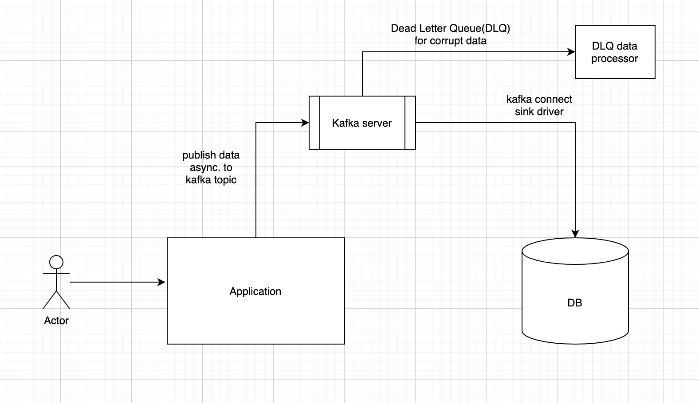

# Kafka Connect With Spring Boot

##Introduction
We have plenty of example with Kafka Connector source(pull mechanism)/sink(push mechanism) but what if we don't have pull mechanism as source connector?
I have created this mini application where we want async writes to DB from our application once it's processed.

##Scenario
Our application is getting continues data via REST API and we don't need that data immediately but we need high latency.
As directly using Spring JPA makes writes synchronous, and acknowledgement may increase applications overall latency.

#Solution
Considering ACID properties and some mechanism to handle corrupt data we can use Kafka publisher from our application level to publish data async. to kafka topic and on the other side we can deploy confluent platform and can use Kafka JDBC sink connector to dump data to DB.

